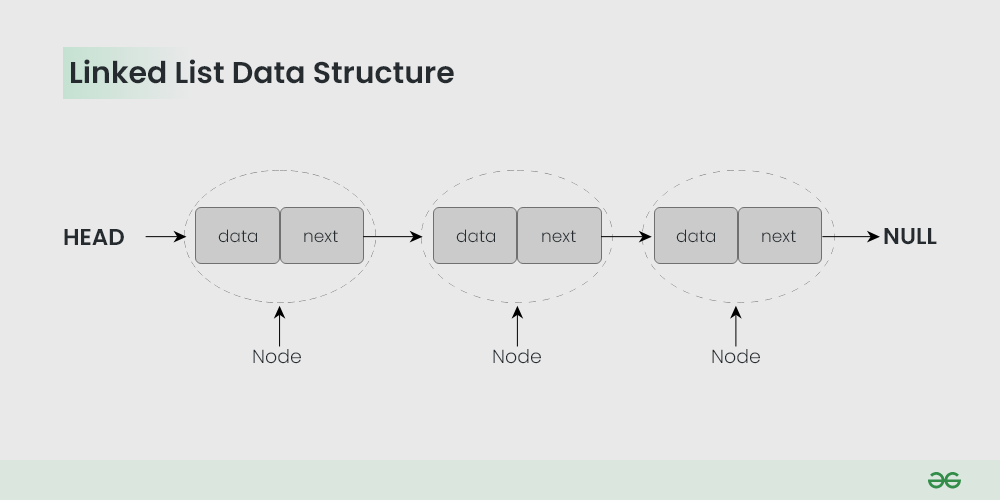

# [Linked List](https://www.geeksforgeeks.org/data-structures-page/linked-list/?ref=lbp)


A linked list is a linear data structure, in which the elements are not stored at contiguous memory locations.

The elements in a linked list are linked using pointers as shown in the below image:



## Common

```
typedef struct Node
{
  int data;
  struct Node *next;
} Node;

Node *createNode(int data)
{
  Node *newNode = (Node *)malloc(sizeof(Node));
  newNode->data = data;
  newNode->next = NULL;
  return newNode;
}
```

## Single Linked List

* **Insertion**: O(1) for head, O(n) for tail or in between
* **Deletion**: O(1) for head, O(n) for tail or in between
* **Space Complexity**: O(n)

## Doubly Linked List

* **Insertion**: O(1) for head or tail, O(n) for in between
* **Deletion**: O(1) for head or tail, O(n) for in between
* **Space Complexity**: O(n)

## Circular Linked List

* **Insertion**: O(1) for head, O(n) for tail or in between
* **Deletion**: O(1) for head, O(n) for tail or in between
* **Space Complexity**: O(n)

## Doubly Circular Linked List

* **Insertion**: O(1) for head or tail, O(n) for in between
* **Deletion**: O(1) for head or tail, O(n) for in between
* **Space Complexity**: O(n)